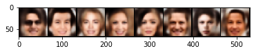

# information-bottleneck-gan

In progress Pytorch implementation of the paper [Information bottleneck through variational glasses](https://arxiv.org/abs/1912.00830).

`python train_ibn_dcgan.py --epochs=150 --dataset-name=CelebA --g-learning-rate=2e-4 --eg-learning-rate=2e-4 --d-learning-rate=2e-4 --data-dir= /path/to/noncropped/CelebA/`

CelebA generation after 40 epochs:

    

